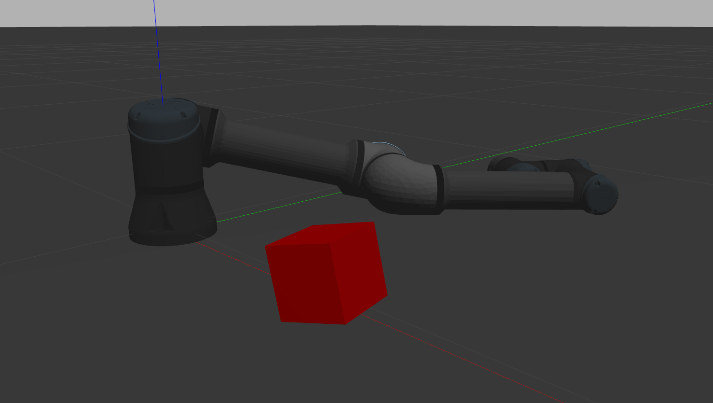

# ROS 2 Gazebo Simulation: UR5 Pick and Place


This repository contains a ROS 2 workspace for simulating a Universal Robots UR5 arm performing a pick and place task in Gazebo.

---

### ⚙️ Setup Instructions

1.  **Prerequisites:** Ensure you have ROS 2 Humble and Gazebo installed.

2.  **Install Dependencies:** Navigate to your workspace root (`~/workspaces`) and use `rosdep` to install all necessary dependencies for the packages in your `src` folder.
    ```bash
    rosdep install --from-paths src --ignore-src -r -y
    ```

---

### 🚀 Running the Simulation

After the setup is complete, run the simulation by following these steps in order from your workspace root (`~/workspaces`).

1.  **Build the Workspace:** Compile the packages using `colcon`.
    ```bash
    colcon build
    ```

2.  **Source the Overlay:** In every new terminal you open, you must source the setup file to make the ROS 2 packages available.
    ```bash
    source install/setup.bash
    ```

3.  **Launch the Simulation:** Start the Gazebo simulation with the UR5 robot performing the pick and place task.
    ```bash
    ros2 launch ur_simulation_gazebo ur5_pick_and_place.launch.py
    ```