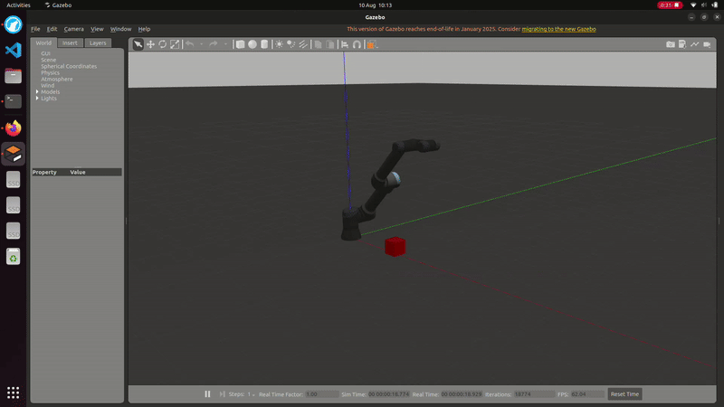
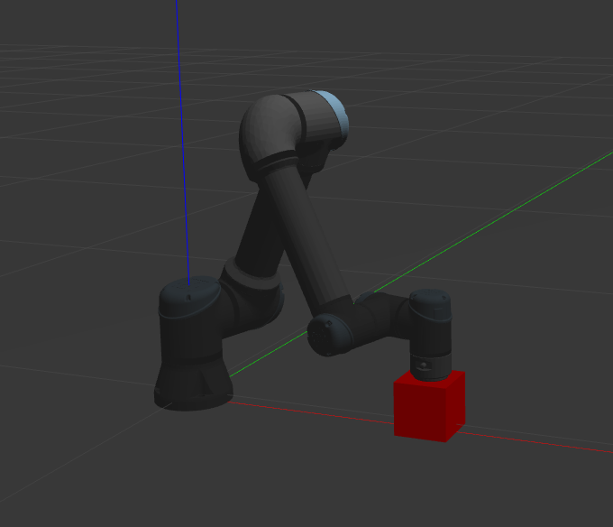

Universal_Robots_ROS2_Gazebo_Simulation
==========================================

Example files and configurations for Gazebo Classic simulation of Universal Robots' manipulators.

## Build status
Since Gazebo classic will not be supported from ROS 2 Jazzy on, this package is built against
Humble only. The `ros2` branch contains a version that is running on ROS Rolling on
Ubuntu 22.04 at the time of writing. However, it is no longer supported.

<table width="100%">
  <tr>
    <th></th>
    <th>Humble</th>
  </tr>
  <tr>
    <th>Branch</th>
    <td><a href="https://github.com/UniversalRobots/Universal_Robots_ROS2_Gazebo_Simulation/tree/humble">humble</a></td>
  </tr>
  <tr>
    <th>Build status</th>
    <td>
      <a href="https://github.com/UniversalRobots/Universal_Robots_ROS2_Gazebo_Simulation/actions/workflows/humble-binary-main.yml?query=event%3Aschedule++">
         
      </a> <br />
    </td>
  </tr>
</table>

A more [detailed build status](ci_status.md) shows the state of all CI workflows inside this repo.
Please note that the detailed view is intended for developers, while the one here should give end
users an overview of the current released state.

## Using the repository
Skip any of below steps is not applicable.

### Setup ROS Workspace

1. Create a colcon workspace:
   ```
   export COLCON_WS=~/workspaces/ur_gazebo
   mkdir -p $COLCON_WS/src
   ```

   > **NOTE:** Feel free to change `~/workspaces/ur_gazebo` to whatever absolute path you want.

   > **NOTE:** Over time you will probably have multiple ROS workspaces, so it makes sense to them all in a subfolder.
     Also, it is good practice to put the ROS version in the name of the workspace, for different tests you could just add a suffix to the base name `ur_gazebo`.

1. Download the required repositories and install package dependencies:
   ```
   cd $COLCON_WS/src
   git clone -b humble https://github.com/UniversalRobots/Universal_Robots_ROS2_Gazebo_Simulation.git
   rosdep update && rosdep install --ignore-src --from-paths . -y
   ```

### Configure and Build Workspace:
To configure and build workspace execute following commands:
  ```
  cd $COLCON_WS
  colcon build --symlink-install
  ```

## Running Simulation
1.  **Build the Workspace:** Compile the packages using `colcon`.
    ```bash
    colcon build
    ```

2.  **Source the Overlay:** In every new terminal you open, you must source the setup file to make the ROS 2 packages available.
    ```bash
    source install/setup.bash
    ```

3.  **Launch the Simulation:** Start the Gazebo simulation with the UR5 robot performing the pick and place task.
    ```bash
    ros2 launch ur_simulation_gazebo ur5_pick_and_place.launch.py
    ```


    



Note: The simulation may not run identically every time. Below is from an iteration where the path collided with the floor.


